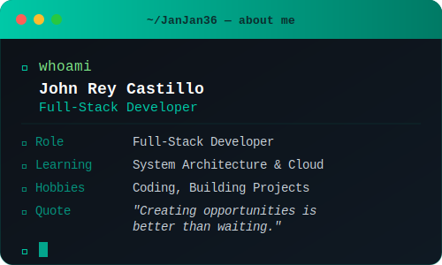
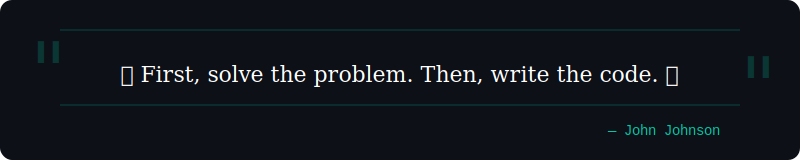

  
  
  
  
  

  
  

---

## 🧑‍💻 About Me

 

---

## 🧠 Tech Stack

**{Frontend}** 

  
**{Backend}** 

  
**{Database}** 

  
**{Tools & Deployment}** 

---

## 📊 GitHub Stats

 

 

---

## 🏆 GitHub Trophies

  

---

## ✍️ Dev Quote

 

 

## 🔝 Top Contributed Repos

  

---

## Contribution Graph

  

---

